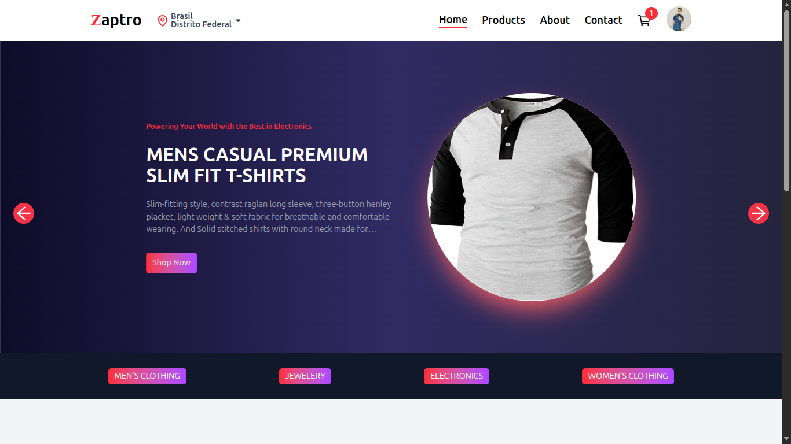
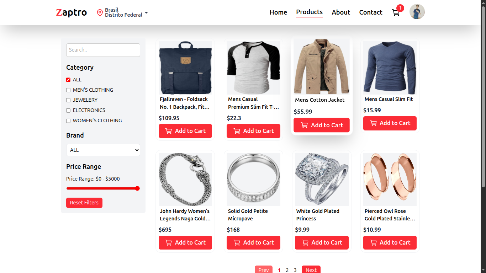
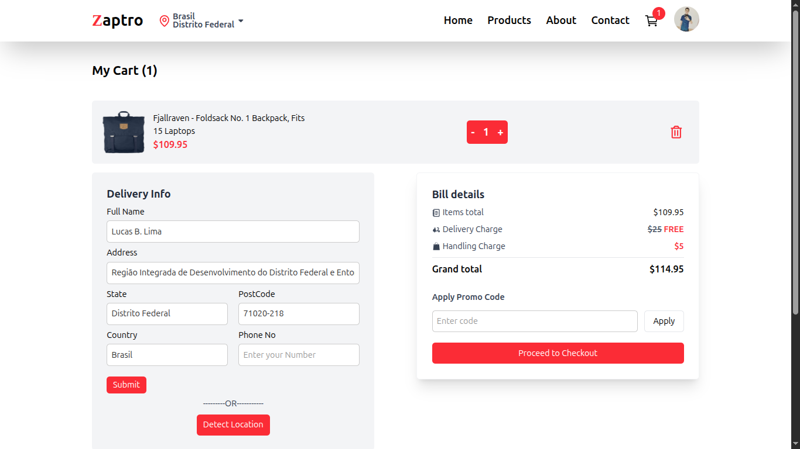
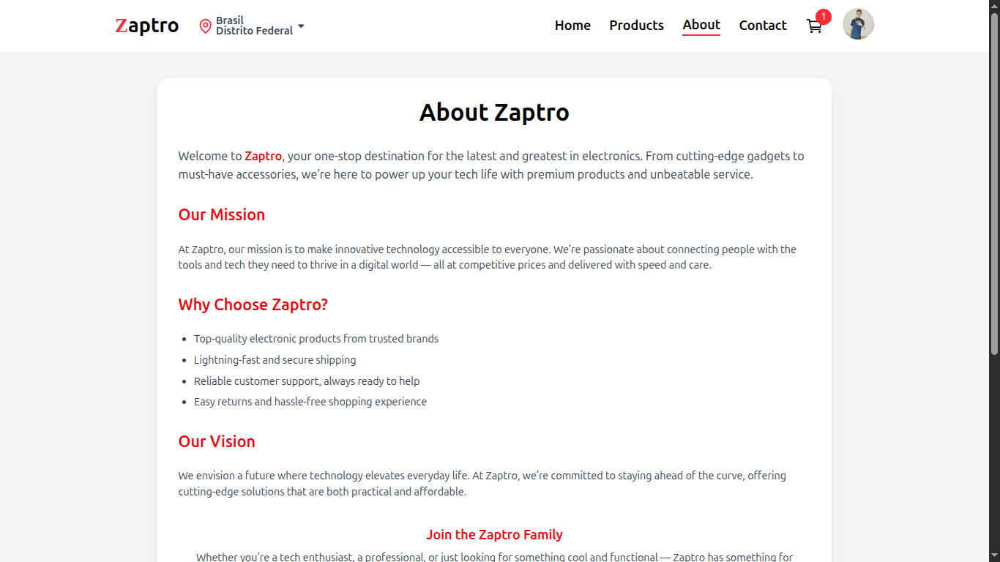
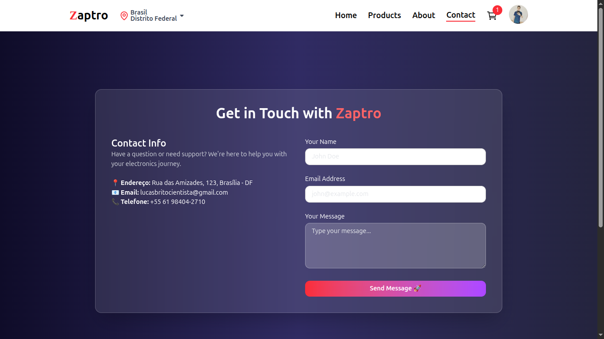

# 🛒 Zaptro - Frontend E-commerce

Zaptro é um frontend de e-commerce desenvolvido com React + Vite, consumindo APIs externas para listagem de produtos.  
O projeto simula uma loja virtual moderna com autenticação de usuários, carrinho de compras e interface responsiva.

---

## 🚀 Tecnologias Utilizadas

- React 19
- Vite 7
- React Router DOM
- Axios
- TailwindCSS
- Clerk (Autenticação)
- React Slick (Carousel)
- React Toastify (Notificações)
- Lucide React (Ícones)
- Lottie React (Animações)

---

## 📦 Funcionalidades

- ✅ Listagem dinâmica de produtos via API externa
- ✅ Página de detalhes do produto
- ✅ Sistema de autenticação com Clerk
- ✅ Carrinho de compras
- ✅ Notificações visuais
- ✅ Carousel de produtos
- ✅ Interface responsiva
- ✅ Scroll automático para topo

---

## 🖼️ Preview







---

## ⚙️ Como rodar o projeto

### 1️⃣ Clone o repositório

```bash
git clone https://github.com/lucasb2b/zaptro.git